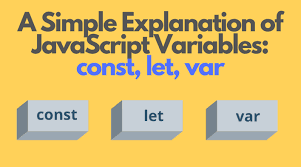

## Что такое JavaScript ?

### Основатель LoftBlog Николай Чернобаев рассказывает про один из самых популярных языков программирования - JavaScript. Что такое JavaScript и зачем стоит его изучать?, Ссылки:, Основы JavaScript:

## Variables are Containers for Storing Data

### JavaScript Variables can be declared in 4 ways:

#### - Automatically.
#### - Using var.
#### - Using let.
#### - Using const.

# Note
#### The var keyword was used in all JavaScript code from 1995 to 2015.

#### The let and const keywords were added to JavaScript in 2015.

#### The var keyword should only be used in code written for older browsers.

# When to Use var, let, or const?

#### 1. Always declare variables

#### 2. Always use const if the value should not be changed

#### 3. Always use const if the type should not be changed (Arrays and Objects)

#### 4. Only use let if you can't use const

#### 5. Only use var if you MUST support old browsers.